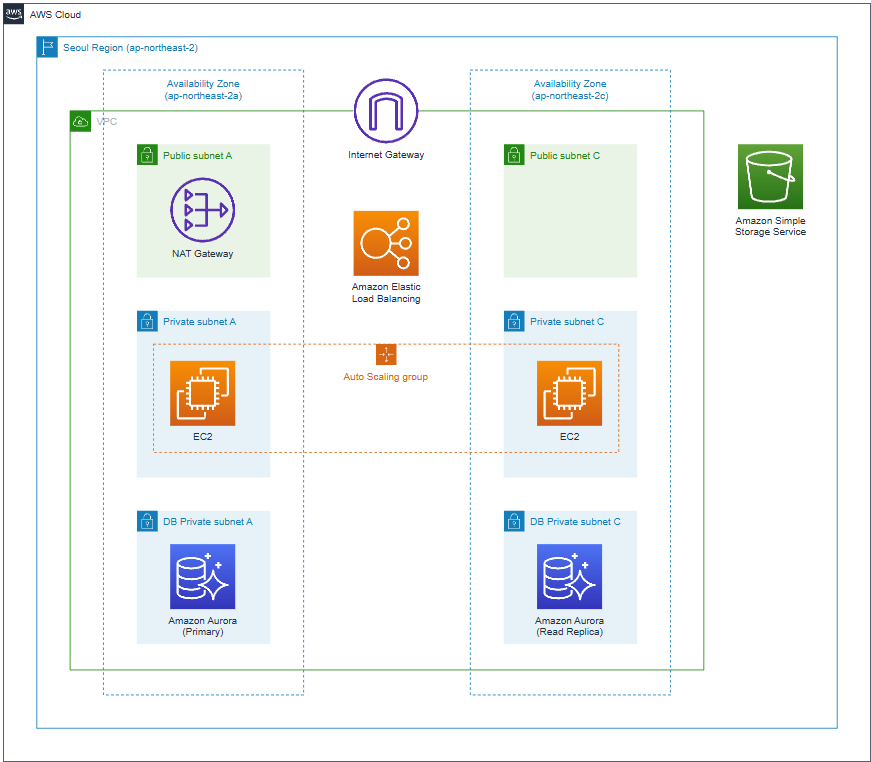

# 🌐 AWS Scalable Web Application  

## 📌 Overview  
This project deploys a **highly available, auto-scaling web application** using AWS.  
The architecture ensures **scalability, fault tolerance, and cost efficiency**.  

## 🛠️ Technologies & AWS Services  
- **Compute:** Amazon EC2 (Auto Scaling)  
- **Storage:** Amazon S3 (for static content)  
- **Networking:** Amazon VPC, ALB (Application Load Balancer)  
- **Database:** Amazon Aurora (MySQL/PostgreSQL)  
- **Security:** IAM, Security Groups, Route 53  
- **Monitoring:** AWS CloudWatch, SNS Alerts  

## 📂 Architecture Diagram  
  

## 🚀 Project Implementation  
### **1. Setting Up Networking**  
- Created a **VPC with public & private subnets**  
- Configured **route tables, security groups, and IAM roles**  

### **2. Deploying EC2 Auto Scaling & Load Balancer**  
- Launched **EC2 instances with Auto Scaling**  
- Configured an **Application Load Balancer (ALB)** for traffic distribution  

### **3. Database & Storage Setup**  
- Deployed **Amazon Aurora (RDS) in private subnet**  
- Used **Amazon S3 for static content storage**  

### **4. Monitoring & Cost Optimization**  
- Configured **CloudWatch alarms & logging**  
- Implemented **SNS notifications for instance failures**  

## 📊 Key Learnings  
- How to deploy a **fault-tolerant, auto-scaling web app**  
- Best practices for **secure networking & database integration**  
- Cost optimization techniques with **right-sized EC2 instances**  

## 📌 Future Enhancements  
- Implement **Infrastructure as Code (Terraform)**  
- Set up **CI/CD pipeline with AWS CodePipeline**  
- Use AWS Lambda for **serverless automation**  

---
