# 🚀 Deploying an Auto Scaling Web Service  

Now that I have **set up the VPC and networking**, it's time to deploy a **scalable web service** that can **automatically scale** based on traffic demand. This setup will ensure **high availability** by using:

✅ **Application Load Balancer (ALB)** to distribute traffic  
✅ **Auto Scaling Group (ASG)** to manage EC2 instances dynamically  
✅ **Launch Template** to define EC2 instance configurations  

---

## **1️⃣ Setting Up the Application Load Balancer (ALB)**  
AWS **Elastic Load Balancer (ELB)** helps distribute traffic across multiple instances. There are three types:  
- **Application Load Balancer (ALB)** – Best for HTTP/HTTPS traffic (which I’ll use).  
- **Network Load Balancer (NLB)** – Used for high-performance networking.  
- **Gateway Load Balancer (GWLB)** – Helps route third-party virtual appliances.

I will configure an **Application Load Balancer** to distribute HTTP traffic to my web servers.

### **Creating the ALB**
1. In the **AWS Console**, I will navigate to **EC2** → **Load Balancers** under **Load Balancing**.  
2. Click **Create Load Balancer**.  
3. Select **Application Load Balancer**.  

📸 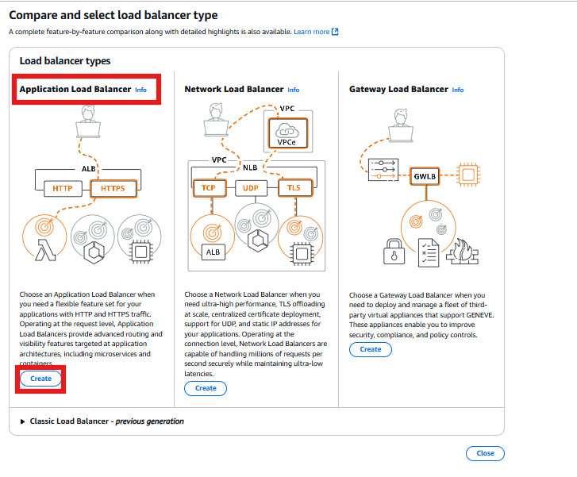

---

### **Naming & Configuring the ALB**
1. **Load Balancer Name:** `web-ALB`  
2. **Scheme:** `Internet-facing`  
3. **IP Address Type:** `IPv4`  
4. **VPC:** `scalable-webapp-vpc`  
5. **Availability Zones:**  
   - **Public Subnet 1 (`us-east-1a`)**  
   - **Public Subnet 2 (`us-east-1c`)**

📸 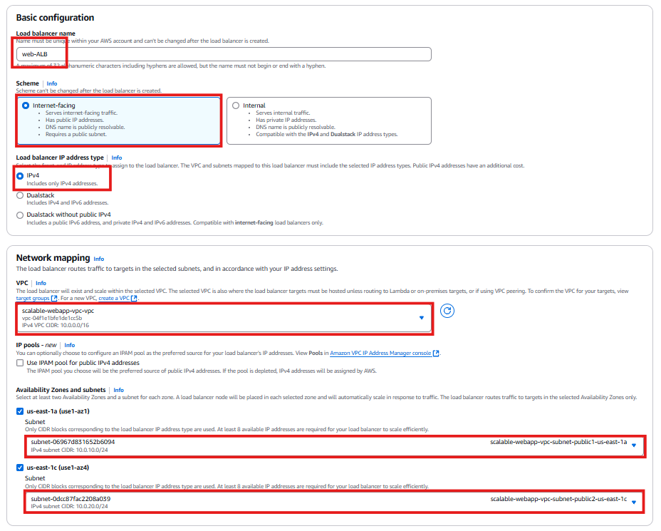

✅ **Why?** By deploying the ALB in **two public subnets**, I ensure redundancy and fault tolerance.

---

### **Configuring Security for the ALB**
Since the **ALB needs to accept public traffic**, I will create a **security group** that allows inbound **HTTP (80)** requests.

1. Click **Create new security group**.  
2. **Security Group Name:** `web-ALB-SG`  
3. **Inbound Rules:**  
   - **Allow HTTP (80)** → `0.0.0.0/0 (Anywhere)`.  
4. Click **Create Security Group**.

📸 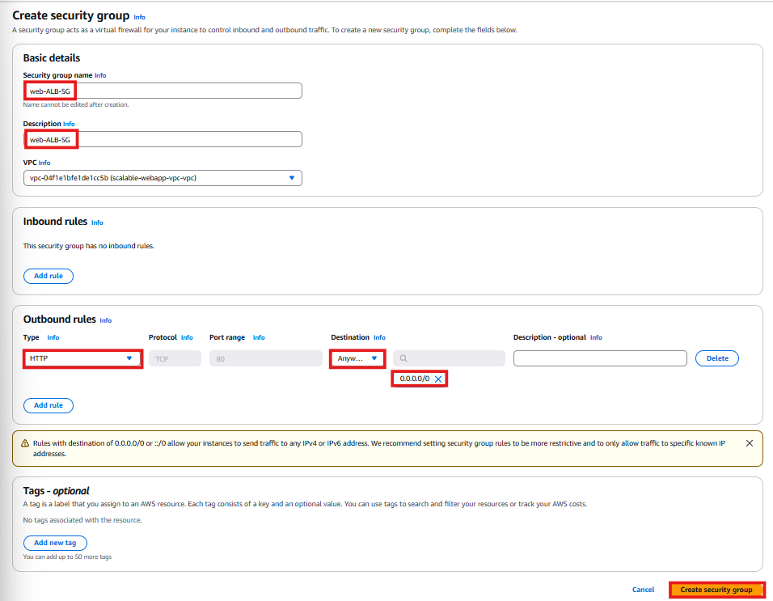

✅ **Why?** This allows **public internet users** to access my web service through the ALB.

---

## **2️⃣ Configuring the Target Group**
The **Target Group** helps route traffic from the ALB to the **EC2 instances**.

1. Navigate to **Target Groups** → **Create Target Group**.  
2. **Target Group Name:** `Web-TG`.  
3. **Target Type:** `Instances`.  
4. **Protocol:** `HTTP`.  
5. **Port:** `80`.  
6. Click **Create Target Group**.

📸 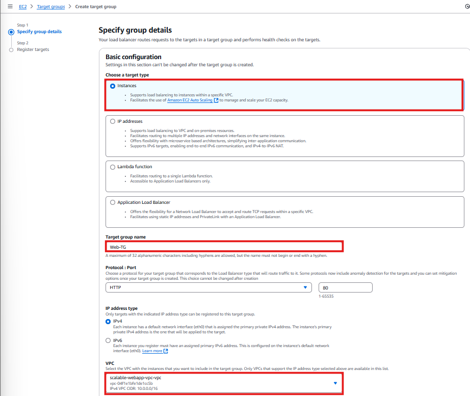

✅ **Why?** The ALB will now know where to forward incoming requests.

---

## **3️⃣ Creating a Launch Template**
Since I need **multiple EC2 instances** to auto-scale, I will use a **Launch Template** to predefine the instance settings.

### **Creating a Security Group for EC2 Instances**
To ensure that only **ALB traffic** reaches the EC2 instances, I will create a **separate security group**.

1. Navigate to **Security Groups** → **Create Security Group**.  
2. **Security Group Name:** `ASG-Web-Inst-SG`.  
3. **Inbound Rules:**  
   - **Allow HTTP (80)** → **Source:** `web-ALB-SG`.  
4. Click **Create Security Group**.

📸 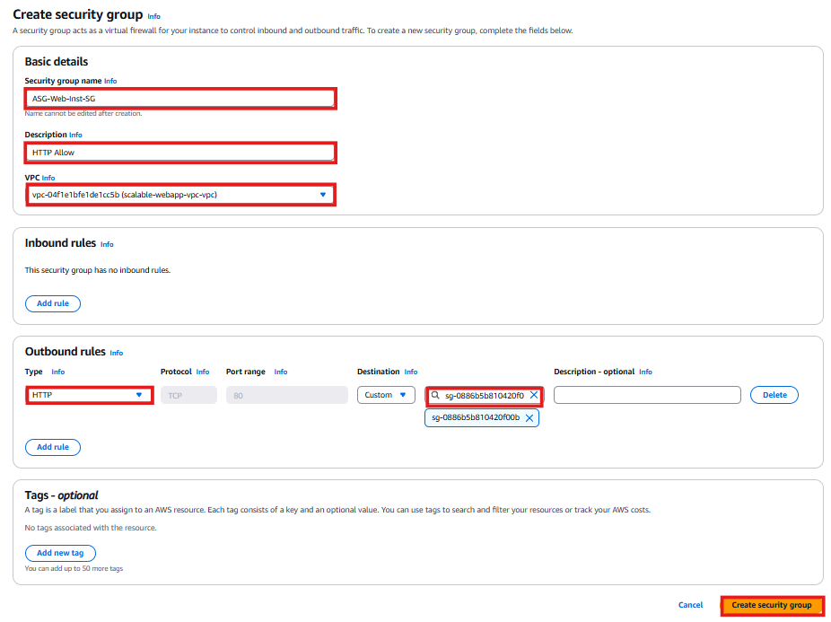

✅ **Why?** This ensures **only traffic from the ALB** can reach my instances, preventing direct access.

---

### **Creating the Launch Template**
1. In the **EC2 Console**, go to **Launch Templates** → **Create Launch Template**.  
2. **Launch Template Name:** `Web-ASG`.  
3. **Template Description:** `Web Service Instances for Auto Scaling`.  
4. ✅ Check **Provide guidance to use with EC2 Auto Scaling**.  
5. **AMI:** Select `Web Server v1` (created earlier).  
6. **Instance Type:** `t2.micro`.  
7. **Security Group:** Select `ASG-Web-Inst-SG`.  
8. Click **Create Launch Template**.

📸 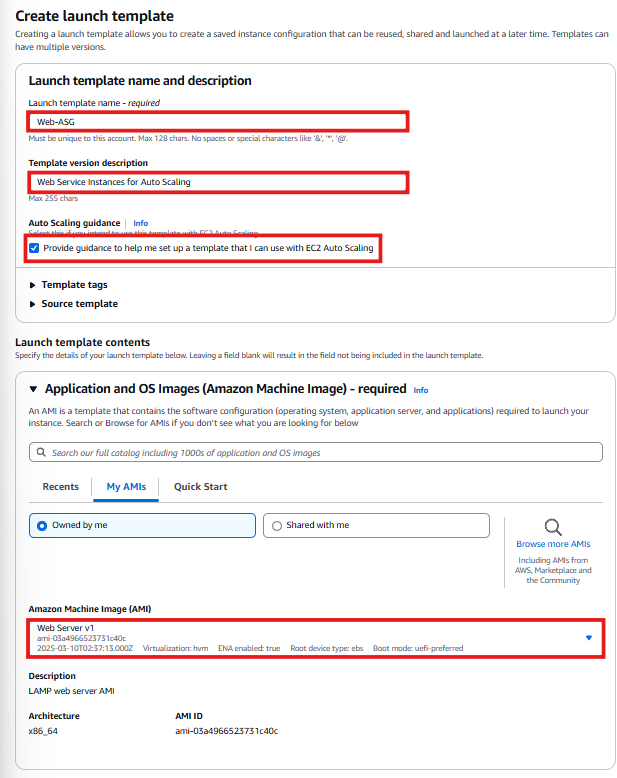

✅ **Why?** The **Launch Template** defines how each new EC2 instance should be configured when scaling.

---

## **4️⃣ Setting Up the Auto Scaling Group**
Now that my **ALB and Launch Template** are ready, I will configure **Auto Scaling**.

1. Navigate to **Auto Scaling Groups** → **Create Auto Scaling Group**.  
2. **Auto Scaling Group Name:** `Web-ASG`.  
3. **Launch Template:** `Web-ASG`.  
4. **VPC:** `scalable-webapp-vpc`.  
5. **Subnets:**  
   - **Private Subnet 1 (`us-east-1a`)**  
   - **Private Subnet 2 (`us-east-1c`)**

📸 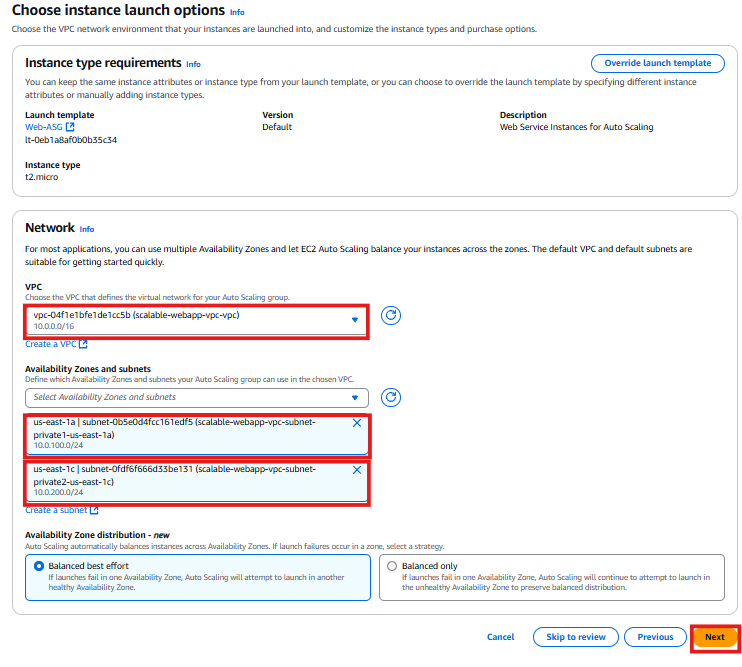

---

### **Attaching ALB to Auto Scaling Group**
1. Under **Load Balancing**, select **Attach to an existing Load Balancer**.  
2. Choose **Web-TG (Target Group created earlier)**.  
3. Enable **CloudWatch monitoring** to track scaling performance.  
4. Click **Next**.

📸 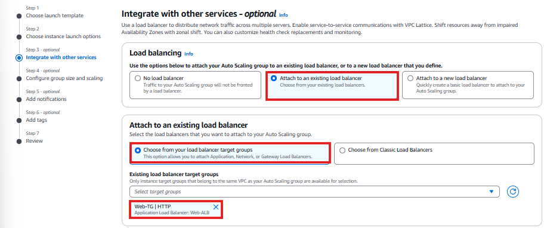

✅ **Why?** This ensures my **ALB dynamically routes traffic** to the instances launched by Auto Scaling.

---

### **Configuring Auto Scaling Policies**
1. **Desired Capacity:** `2`  
2. **Minimum Capacity:** `2`  
3. **Maximum Capacity:** `4`  
4. **Scaling Policy:**  
   - Select **Target Tracking Scaling Policy**.  
   - **Target Value:** `30% CPU Utilization`.  
5. Click **Next**.

📸 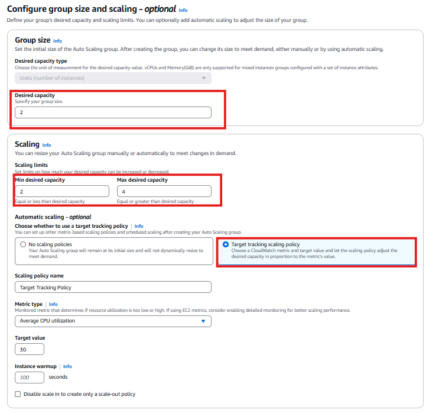

✅ **Why?** This ensures my **web service runs smoothly**, scaling up when CPU usage **exceeds 30%**.

---

# 🚀 Checking Web Service & Testing Auto Scaling  

Now that the **Auto Scaling Group (ASG) and Application Load Balancer (ALB)** are fully configured, it's time to **test** if everything is working correctly.  

In this section, I will:  
✅ **Verify that the web service is accessible** via the ALB.  
✅ **Confirm that traffic is distributed correctly** across multiple instances.  
✅ **Perform a load test** to check if Auto Scaling **triggers new instances when needed**.  

---

## **1️⃣ Checking Web Service & Load Balancer**  

To verify that my **web service is running**, I will access it through the **Application Load Balancer (ALB)**.

### **Accessing the Web Service via ALB**
1. Navigate to **EC2 Console** → **Load Balancers**.  
2. Select **Web-ALB** (the Application Load Balancer created earlier).  
3. Copy the **DNS Name** under the **Basic Configuration** section.  

📸 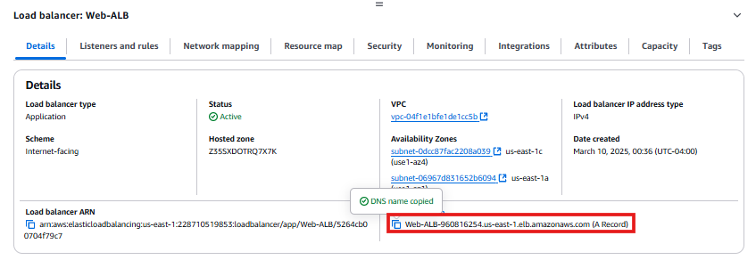  

4. Open a **new browser tab** and paste the copied **DNS Name** into the address bar.  
5. I should now see my **web service homepage**, confirming that the ALB is successfully routing traffic.  

📸 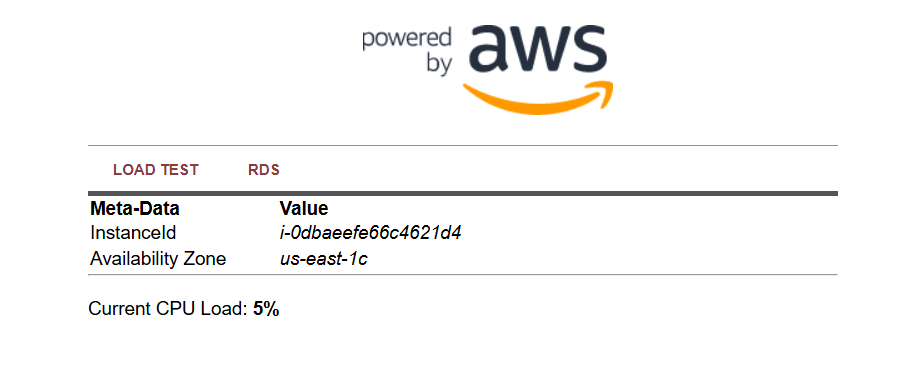  

---

### **Verifying Round Robin Load Balancing**
By default, the **ALB uses a Round Robin algorithm**, meaning each request is **sent to a different instance in the Target Group**.

1. **Click the refresh button** in the browser multiple times.  
2. Each time I refresh, the web page should be **served from a different EC2 instance**.  
3. I can verify this by checking the **hostname** or **instance metadata** displayed on the webpage.  

📸 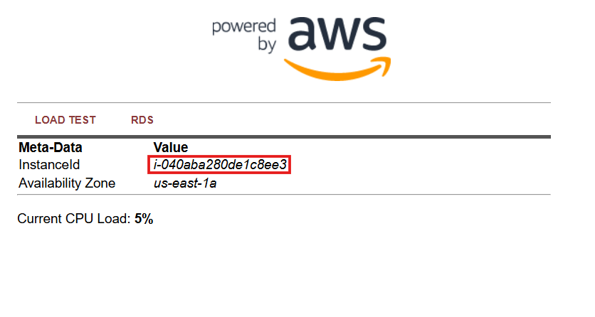  

✅ **Why?** This confirms that ALB is properly **distributing traffic** across multiple instances.

---

## **2️⃣ Load Testing the Auto Scaling Group**
The Auto Scaling Group is configured to **adjust instance count dynamically** based on CPU utilization. The **scaling policy is set to trigger** when CPU usage exceeds **30%**.  

### **Understanding the Scaling Policy**
- **If CPU utilization is below 30%** → Auto Scaling **removes instances** to optimize cost.  
- **If CPU utilization exceeds 30%** → Auto Scaling **adds new instances** to handle load.  

📸 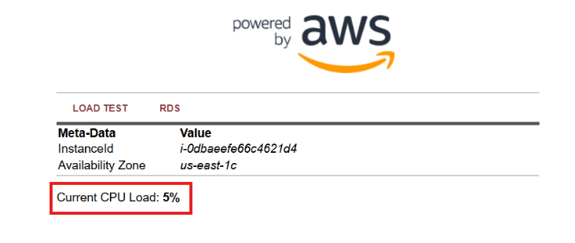  

---

### **Simulating High CPU Load**
To trigger **Auto Scaling**, I will artificially **increase CPU load** using a built-in **LOAD TEST menu**.

1. **On the web page**, I will click the **LOAD TEST** menu option.  
2. The page will change, and the **CPU load indicator** will appear.  
3. Clicking the **logo** at the top left of the page will show the **current instances under load**.  

📸 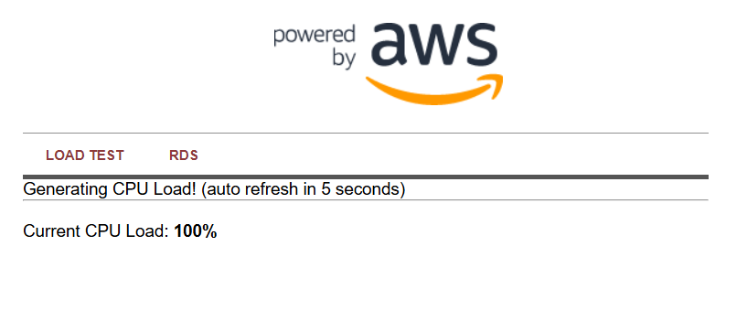  

---

### **Monitoring Auto Scaling Behavior**
Now that the **CPU load is increasing**, I will monitor how **Auto Scaling responds**.

1. Navigate to **EC2 Console** → **Auto Scaling Groups**.  
2. Select **Web-ASG** (the Auto Scaling Group).  
3. Click the **Monitoring tab**.  
4. Under **Enabled Metrics**, select **EC2 → CPU Utilization (Percent)**.  
5. Change the **timeframe to 1 hour**.  

📸 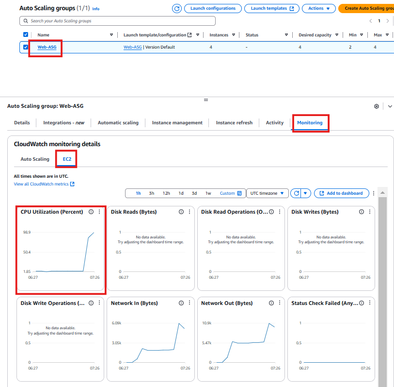  

- After **a few minutes**, the **CPU Utilization graph** should start increasing.  
- Auto Scaling will detect this **increase in CPU load** and **launch additional instances**.  

📸 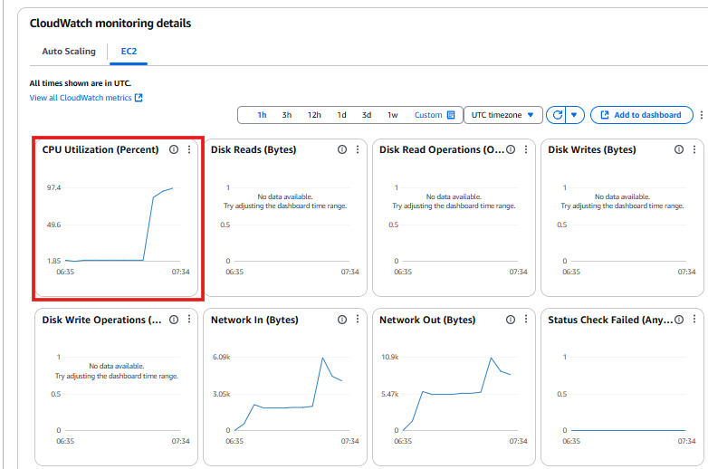  

---

### **Checking Auto Scaling Activity**
1. **Wait for 5 minutes (300 seconds)** and click the **Activity tab**.  
2. I should now see that **Auto Scaling has deployed additional EC2 instances**.  

📸 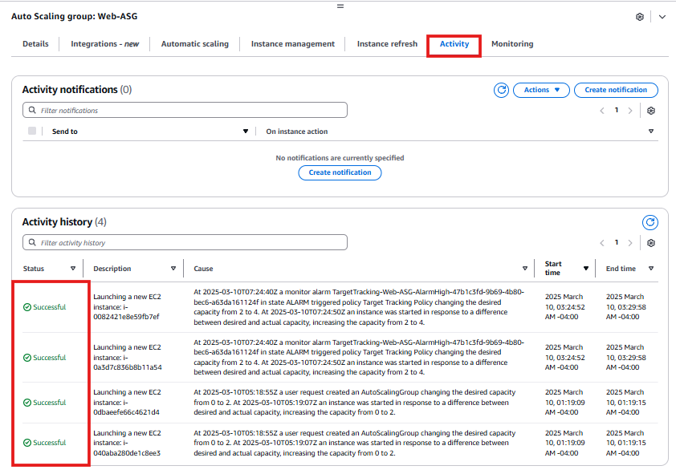  

---

### **Confirming New Instances Are Running**
1. Navigate to **EC2 Console** → **Instances**.  
2. Under **Instance State**, I should see that **two additional instances have been launched**, bringing the total to **four running instances**.  

📸 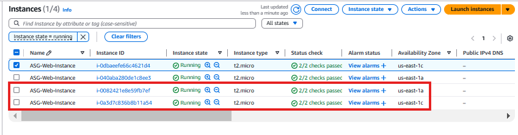  

3. If I **refresh the web page using the ALB DNS**, I should now see traffic being handled by **new instances** that were not there before.  
4. The **CPU load on the new instances will be 0% initially**, as they were just launched.  

📸 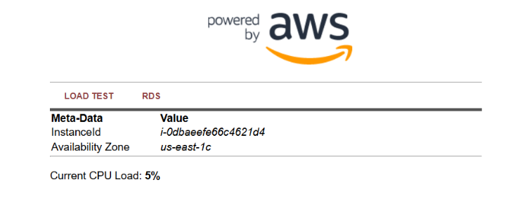  

✅ **Why?** This confirms that **Auto Scaling is dynamically adding instances** to maintain optimal performance.

---

## **3️⃣ Stopping the Load Test**
Now that I have confirmed that Auto Scaling **works as expected**, I will stop the load test.

1. Close the **LOAD TEST web page** to prevent additional CPU load.  
2. Navigate to **EC2 Console** → **Auto Scaling Groups**.  
3. Wait for a few minutes, and Auto Scaling will automatically **terminate extra instances** as CPU load drops below **30%**.  

📸 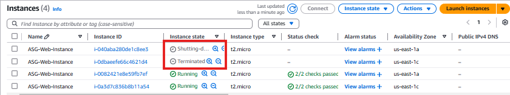  

✅ **Why?** This ensures that **only the required number of instances are running**, keeping costs optimized.

---

## **✅ Summary of the Test**
At this stage, I have successfully:  
✅ **Verified that the web service is accessible via ALB**.  
✅ **Confirmed that traffic is distributed across instances (Round Robin)**.  
✅ **Performed a Load Test and observed Auto Scaling in action**.  
✅ **Watched Auto Scaling add and remove instances dynamically**.  

📸 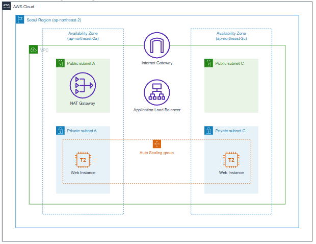  

---

## **Next Steps**
➡️ **[Review Troubleshooting Guide](../docs/troubleshooting.md)**  
➡️ **[Deploy Amazon RDS Database](../docs/rds-deployment.md)**   

---
