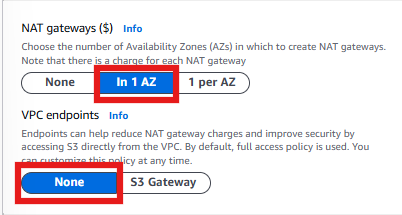

# 🚀 Creating a VPC for a Highly Available AWS Scalable Web Application  

## **1️⃣ Moving to the VPC Service**
After logging into the **AWS Management Console**, I will navigate to the **VPC** service from the **AWS Services** menu. This allows me to manage networking resources, ensuring that my application infrastructure is isolated and secure.  

  

---

## **2️⃣ Creating a VPC Using the VPC Wizard**
To begin setting up the **AWS environment**, I will create a **VPC** where all resources will be provisioned. A VPC (Virtual Private Cloud) provides a logically isolated network for my AWS resources, similar to a traditional on-premises network.  

1. In the **VPC Dashboard**, I will click **Create VPC**.  
2. I will select **"VPC and more"** from the **Resource to create** tab.  
3. I will change the **Name tag** to `scalable-webapp-vpc` to keep my AWS environment organized.  
4. I will leave the **IPv4 CIDR block** settings as default to allow a wide range of private IP addresses for AWS resources.  

  

---

## **3️⃣ Configuring Subnets for High Availability**
It is a best practice to **deploy resources across multiple Availability Zones (AZs)** for **high availability and fault tolerance**. By creating **two public subnets** and **two private subnets** in different AZs, I ensure that my application remains resilient to failures in a single data center.

### **Subnet Configuration Table**
| **Availability Zone** | **Public Subnet CIDR** | **Private Subnet CIDR** |
|----------------------|----------------------|----------------------|
| **us-east-1a** | `10.0.10.0/24` | `10.0.100.0/24` |
| **us-east-1c** | `10.0.20.0/24` | `10.0.200.0/24` |

1. I will create **two public subnets** in **AZ-a and AZ-c** and assign the respective **CIDR blocks** as per the table above. Public subnets will allow internet-facing resources, such as a Load Balancer.  
2. I will create **two private subnets** in the same AZs with their designated **CIDR blocks**. These will host backend resources, such as databases, that do not need direct internet access.  
3. I will ensure that the **public subnets are set to auto-assign public IPv4 addresses** to allow internet access to public-facing instances.  

  

---

## **4️⃣ Configuring a NAT Gateway for Private Subnets**
A **NAT (Network Address Translation) Gateway** allows **private subnet instances** to access the internet **without exposing them directly to incoming traffic**. This is useful for pulling security updates, software patches, or connecting to external services while maintaining network security.

1. I will select **NAT Gateway** from the **VPC Dashboard**.  
2. I will place the **NAT Gateway** in the **public subnet of AZ-a** to optimize costs while ensuring outbound connectivity for private resources.  
3. For proper functionality, I will assign an **Elastic IP (EIP)** to the NAT Gateway, which provides a **fixed public IP address** for outbound internet access.    

  

---

## **5️⃣ Enabling DNS Settings**
Enabling **DNS hostnames and resolution** ensures that AWS services and instances within my VPC can communicate using domain names instead of only IP addresses.  

- ✅ **Enable DNS Hostnames** → Allows instances in the VPC to resolve domain names.  
- ✅ **Enable DNS Resolution** → Ensures services like Route 53 and internal DNS functionality work correctly.  

After confirming all settings, I will click **Create VPC**.  

  

---

## **6️⃣ Verifying the Created VPC and Network Resources**
Once the **VPC is successfully created**, AWS automatically provisions related **network resources**, including subnets, route tables, and security settings. I will verify the following:

- The **VPC CIDR block** matches my planned configuration.  
- The **subnets are correctly associated with the appropriate Availability Zones** to ensure high availability.  
- The **route tables are correctly configured**, with public subnets using the **Internet Gateway** and private subnets using the **NAT Gateway**.  
- The **network ACLs (Access Control Lists) allow necessary traffic flow** based on my architecture needs.  

  

---

## **✅ Next Steps**
Now that the **VPC and networking setup** is complete, I will proceed to:

➡️ **[Deploying EC2 & Auto Scaling Instances](../docs/ec2-deployment.md)**  
 

---
