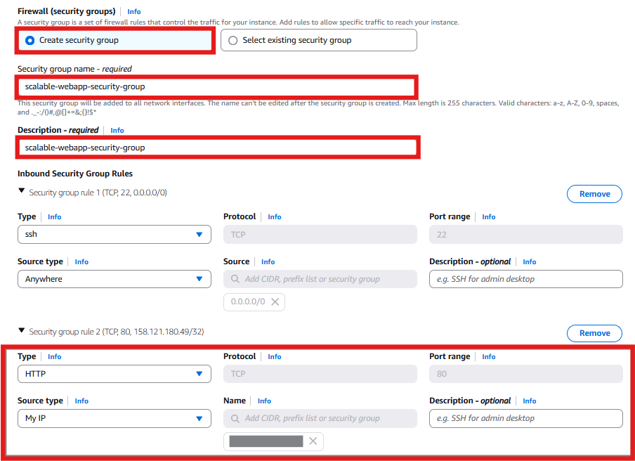
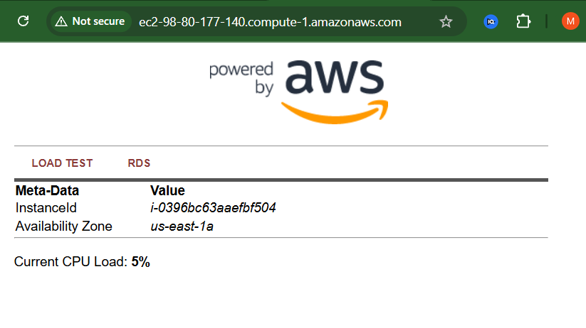

# 🚀 Deploying an EC2 Web Server and Creating a Custom AMI  

## **1️⃣ Navigating to the EC2 Service**
To launch an EC2 instance, I will first navigate to the **EC2 Dashboard** in the AWS Console.  

1. In the **AWS console search bar**, I will type **EC2** and select it.  
2. I will click **EC2 Dashboard** at the top of the left menu.  
3. I will press the **Launch instance** button and select **Launch instance** from the dropdown menu.  

  

---

## **2️⃣ Configuring the Instance Settings**
### **Naming the Instance**
1. In the **Name** field, I will enter:  
   - **Key:** `Name`  
   - **Value:** `Web server for scalable web application`  

### **Selecting an Amazon Machine Image (AMI)**
- I will check that the **default AMI** is selected, which provides a preconfigured environment.  

  

---

## **3️⃣ Choosing an Instance Type**
- I will select **t2.micro** as the instance type, which is eligible for the AWS Free Tier and provides sufficient resources for this web server.  

  

---

## **4️⃣ Configuring Network Settings**
I will define where the EC2 instance is deployed by selecting a **VPC and subnet**.  

1. I will click the **Edit button** in **Network settings**.  
2. I will choose the **scalable-webapp-vpc** created earlier.  
3. I will select a **public subnet** (e.g., `scalable-webapp-subnet-public1-us-east-1a`).  
4. I will ensure **Auto-assign Public IP is set to Enable**, so the instance has internet access.  

| **Key** | **Value** |
|---------|----------|
| **VPC** | `scalable-webapp-vpc` |
| **Subnet** | `scalable-webapp-subnet-public1-us-east-1a` |
| **Auto-assign Public IP** | `Enable` |

  

---

## **5️⃣ Configuring Security Groups**
Security groups act as a firewall that controls inbound and outbound traffic. Following the principle of **least privilege**, I will only allow the required connections.  

1. I will create a new **Security Group**.  
2. In **Security Group Name**, I will enter: `scalable-webapp-security-group`.  
3. I will **add a rule** to allow **HTTP traffic (TCP/80)** for web traffic.  
4. I will set the **Source** to **My IP**, restricting access to only my current location.  

| **Rule** | **Type** | **Protocol** | **Port Range** | **Source** |
|----------|---------|-------------|---------------|-----------|
| Allow HTTP | HTTP | TCP | 80 | My IP |

📌 *By restricting access to my IP, I am ensuring that only I can access the server initially. Later, this can be expanded for public access when deploying the full application.*  

  

---

## **6️⃣ Enabling Metadata Version 2**
AWS provides instance metadata that allows retrieval of information about the instance. **Version 2 (IMDSv2)** improves security by requiring a session token for requests.

1. I will expand the **Advanced Details** tab.  
2. I will scroll down to **Metadata options** and select **V2 only (token required)**.  

  

---

## **7️⃣ Adding User Data for Web Server Configuration**
User Data is a script that executes automatically when the instance first launches. I will use it to install a **LAMP stack** and deploy a sample web application.  

1. In the **User data** field, I will enter the a similar script:  

```sh
#!/bin/sh

# Install a LAMP stack
dnf install -y httpd wget php-fpm php-mysqli php-json php php-devel
dnf install -y mariadb105-server
dnf install -y httpd php-mbstring

# Start the web server
chkconfig httpd on
systemctl start httpd

# Install the web pages
if [ ! -f /var/www/html/webapp.zip ]; then
   cd /var/www/html
   wget -O 'webapp.zip' 'https://example.com/webapp.zip'
   unzip webapp.zip
fi

# Install AWS SDK for PHP
if [ ! -f /var/www/html/aws.zip ]; then
   cd /var/www/html
   mkdir vendor
   cd vendor
   wget https://docs.aws.amazon.com/aws-sdk-php/v3/download/aws.zip
   unzip aws.zip
fi

# Update existing packages
dnf update -y
```
📌 This script installs a LAMP stack and deploys a sample web application hosted on a public repository.

## **8️⃣ Launching the Instance**
After confirming all settings, I will click **Launch instance**.

- A message will appear indicating that the instance is being created.
- I will click **View all instances** to check the status.

  

---

## **9️⃣ Checking the Instance Status**
Once the **Instance State** shows as **Running**, I will retrieve the **Public DNS or IPv4 address** and open it in a web browser.

📌 *If using Chrome, I will ensure the URL begins with `http://` instead of `https://` to prevent connection issues.*

  

---

## **🔹 Creating a Custom AMI**
An **Amazon Machine Image (AMI)** captures the instance configuration and can be used to launch identical instances in the future.

1. In the **EC2 console**, I will select the running instance.
2. Click **Actions** → **Image and templates** → **Create Image**.
3. I will enter the following details:  

| **Key** | **Value** |
|---------|----------|
| **Image Name** | `Web Server v1` |
| **Image Description** | `LAMP web server AMI` |

4. I will click **Create Image** and wait for the process to complete.

  

---

## **🔹 Verifying the AMI**
1. In the **EC2 left menu**, I will navigate to **AMIs** under the **Images** section.
2. I will check the **Status** column:
   - If the status is `Pending`, I will wait for it to change to `Available`.
   - Once `Available`, the AMI is ready for use.

  

---

## **🔹 Terminating the Instance**
Since I have created a **Custom AMI**, the existing instance is no longer needed.

1. I will go to the **EC2 Dashboard** → **Instances**.
2. Select the instance and click **Instance State** → **Terminate Instance**.
3. Confirm by clicking **Terminate** in the pop-up.

📌 *I will ensure the AMI status is `Available` before terminating the instance.*

  

---

## **✅ Architecture Configured So Far**
At this stage, my environment consists of a **Custom AMI**, which will be used to deploy an **auto-scaling web service** in the next phase.

  

## **✅ Next Steps**
Now that the **EC2 instance and AMI have been created**, I will configure **Auto Scaling and Load Balancer**.

➡️ **[Setting Up Auto Scaling and Load Balancer](../docs/auto-scaling-deployment.md)**

