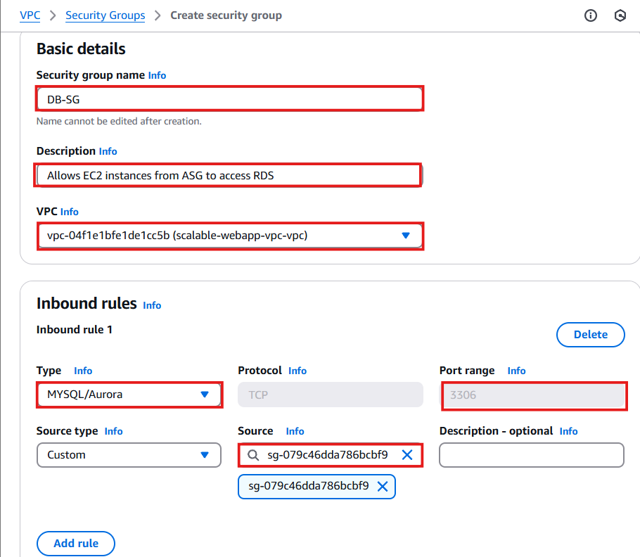
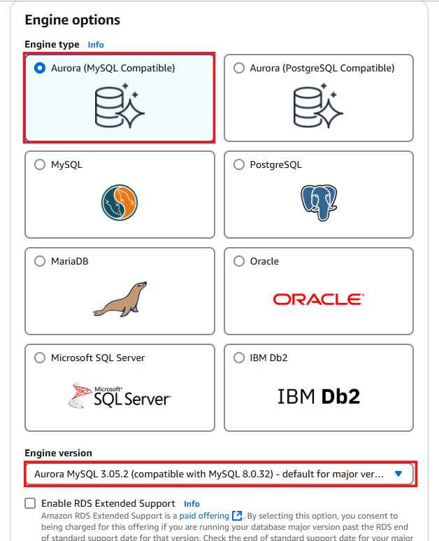
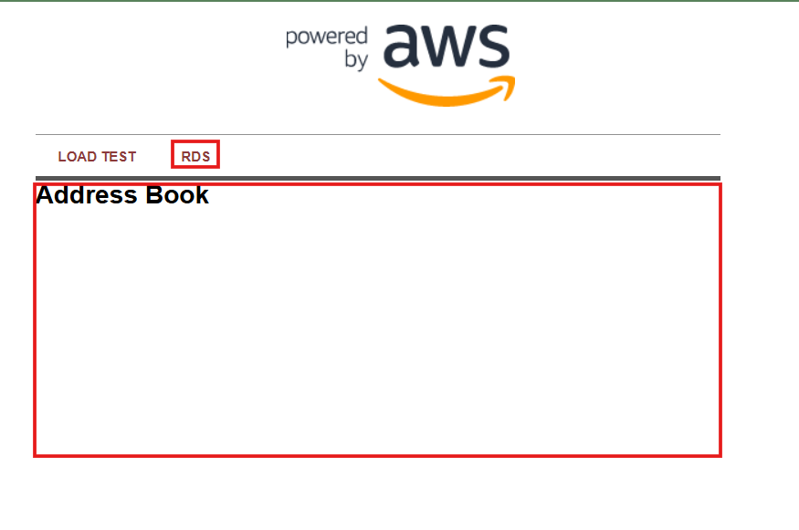

# 🚀 Deploying Amazon RDS & Connecting to Web App  

In this section, I will:  
✅ **Create a security group for RDS** to allow only web server access.  
✅ **Launch an Amazon RDS instance** (Aurora MySQL).  
✅ **Securely store database credentials** using AWS Secrets Manager.  
✅ **Grant EC2 instances access to RDS** using IAM policies.  
✅ **Test the database connection from the web app**.

---

## **1️⃣ Creating a Security Group for RDS**  

The **Amazon RDS instance** needs a **VPC security group** to control access. Since only the **EC2 web servers** should communicate with the database, I will create a **new security group** that **only allows access from the web instances in the Auto Scaling Group**.

### **Creating the Security Group**
1. Navigate to **VPC Console** → **Security Groups**.
2. Click **Create Security Group**.
3. **Enter the following details:**
   - **Security Group Name:** `DB-SG`
   - **Description:** `Allows EC2 instances from ASG to access RDS`
   - **VPC:** `scalable-webapp-vpc`

4. **Define Inbound Rules**:
   - Click **Add Rule**.
   - **Type:** `MySQL/Aurora`
   - **Port:** `3306`
   - **Source:** **Select the existing security group for EC2 (`ASG-Web-Inst-SG`)**.

5. Click **Create Security Group**.

📸 

✅ **Why?**  
- This ensures that only web servers inside **Auto Scaling Group** can access the database.  
- **Public access is denied** for security reasons.

---

## **2️⃣ Creating the Amazon RDS Instance**  

Now, I will **launch an RDS database instance** (Aurora MySQL) inside my **Scalable-Webapp-VPC**.

### **Steps to Create RDS**
1. **Navigate to AWS Console** → **RDS**.
2. Click **Create Database**.
3. **Select database creation method:** ✅ **Standard Create**.
4. **Engine options:**
   - **Engine type:** `Amazon Aurora (MySQL Compatible)`
   - **Version:** `Aurora (MySQL 8.0)`

📸 

---

### **Configuring RDS Settings**
1. **Select Template:** ✅ **Production**
2. **Database Settings:**
   - **DB Cluster Identifier:** `scalable-webapp-db`
   - **Master Username:** `awsuser`
   - **Master Password:** `awspassword`
   - **Confirm Password:** `awspassword`

📸 

---

### **Configuring RDS Compute & Availability**
1. **DB Instance Class:** ✅ `Memory Optimized (db.r5.large)`
2. **Availability & Durability:**
   - ✅ Enable **Aurora Replica in a different AZ** (for high availability).

📸 

✅ **Why?**  
- **Aurora Replicas** increase availability by distributing read traffic across multiple AZs.

---

### **Configuring RDS Networking & Security**
1. **VPC:** `scalable-webapp-vpc`
2. **Subnet Group:** ✅ **Create a new DB subnet group**
3. **Publicly Accessible:** ❌ **No**
4. **VPC Security Group:** **Select the newly created `DB-SG`**
5. **Database Port:** `3306`

📸 

✅ **Why?**  
- The **database stays inside a private subnet** for security.  
- **Only web servers in ASG can access it** through the security group.

---

### **Additional Database Configuration**
1. Scroll down and click **Additional Configuration**.
2. Set the following **database options**:
   - **Initial database name:** `webapp_db`
   - **DB Cluster Parameter Group:** `default.aurora-mysql8.0`
   - **DB Parameter Group:** `default.aurora-mysql8.0`
3. Click **Create Database**.

📸 

✅ **Why?**  
- **Custom database name** makes it easier to connect.
- **Default parameter groups** optimize performance.

---

## **3️⃣ Storing RDS Credentials Securely with AWS Secrets Manager**  

Instead of **hardcoding credentials**, I will **store them securely** in AWS **Secrets Manager**.

### **Creating the Secret**
1. **Navigate to AWS Console** → **Secrets Manager**.
2. Click **Store a new secret**.
3. **Select Secret Type:** ✅ **Credentials for Amazon RDS**.
4. **Enter database credentials:**
   - **Username:** `awsuser`
   - **Password:** `awspassword`
   - **Database:** **Select the RDS instance created earlier**.

📸 

✅ **Why?**  
- **Secures credentials** instead of storing them in application code.
- **Easier to rotate database passwords**.

---

### **Naming and Storing the Secret**
1. **Secret Name:** `mysecret`
2. Click **Next** → **Next** → **Store Secret**.
3. Click **mysecret** → **Retrieve Secret Value**.
4. Verify that **dbname = scalable-webapp-db** exists.

📸 

✅ **Now, my secret is stored and ready to be used by my web app.**

---

## **4️⃣ Allowing Web Server to Access RDS Secret**  

Now, I need to **allow EC2 instances to retrieve database credentials** securely.

### **Creating an IAM Policy**
1. **Navigate to AWS Console** → **IAM**.
2. Click **Policies** → **Create Policy**.
3. **Select AWS Service:** ✅ **Secrets Manager**.
4. **Under Permissions:**
   - Expand **Read** → ✅ Check `GetSecretValue`
5. Click **Next** → **Next**.
6. **Policy Name:** `ReadSecrets`
7. Click **Create Policy**.

📸 

✅ **Now, my policy allows EC2 to retrieve database credentials securely.**

---

### **Attaching the Policy to EC2 Role**
1. **Go to IAM Console** → **Roles**.
2. **Search for:** `SSMInstanceProfile`
3. Click **SSMInstanceProfile**.
4. **Attach Policy:** ✅ Select `ReadSecrets`
5. Click **Attach Policy**.

📸 

✅ **Now, EC2 instances can securely retrieve credentials from AWS Secrets Manager.**

---

## **5️⃣ Testing RDS Connection from Web Server**  

1. **Go to EC2 Console** → **Load Balancers**.
2. **Copy ALB DNS Name**.
3. Open a new browser tab and enter:
http://<ALB-DNS-Name>

4. **Check if the web application connects to RDS**.

📸 

✅ **If data loads successfully, RDS is connected to the web app!** 🎉

---

## **✅ Architecture Configured So Far**
At this stage, I have:
✅ **Deployed an Amazon RDS database inside a private subnet**.  
✅ **Created a security group to allow EC2 access to RDS**.  
✅ **Stored credentials securely in AWS Secrets Manager**.  
✅ **Granted EC2 permission to retrieve credentials**.  
✅ **Connected the web app to RDS via Auto Scaling & ALB**.

📸 

---

## **Next Steps**
➡️ **[Review Troubleshooting Guide](../docs/troubleshooting.md)**  
➡️ **[Test Database Performance & Query Optimization](../docs/rds-performance.md)**  

---
