# 🚀 Managing RDS Performance, Failover, and Scaling  

In this section, I will:  
✅ **Test RDS Failover** to validate high availability across multiple AZs.  
✅ **Create an RDS Snapshot** for backup and restoration.  
✅ **Scale RDS Instance Type** (scale-up/scale-down) for performance tuning.  

---

## **1️⃣ RDS Failover Testing**
When **Multi-AZ** is enabled, Amazon RDS **automatically switches** to a spare replica in another availability zone **during outages**. This ensures **high availability and fault tolerance**.

### **How Failover Works**
- RDS **maintains a synchronous standby replica** in a different AZ.
- If the primary database **fails (planned or unplanned),** RDS **automatically fails over**.
- **Failover time:** 60–120 seconds (**longer for large transactions**).
- The **AWS Console takes additional time to reflect the new AZ**.

### **Manually Triggering an RDS Failover**
To verify that **automatic failover works**, I will **manually initiate** a failover.

#### ✅ **Steps to Perform an RDS Failover**
1. **Go to AWS Console** → **RDS**.
2. Click **Databases** → **Select the database cluster (`scalable-webapp-db`)**.
3. In the **Actions Menu**, click **Failover**.

📸 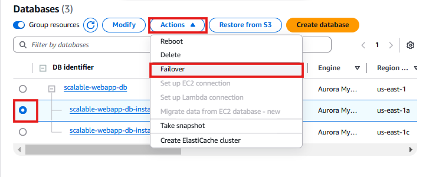

4. A confirmation message will appear. Click **Failover**.

📸 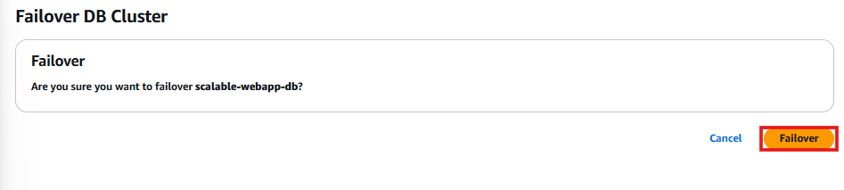

5. The **DB instance status** changes to **"Failing-over"**.  
6. Wait a few minutes, then click **Refresh**.
7. The **Reader and Writer roles should swap**, confirming failover completion.

📸 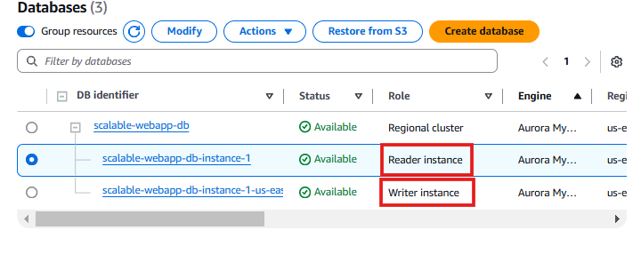

✅ **Why?**
- Ensures **database availability** in case of an AZ failure.
- **Automatically redirects database connections** to the new Writer instance.
- Confirms that **failover works correctly in my setup**.

---

## **2️⃣ Creating an RDS Snapshot (Backup)**
Amazon RDS **supports manual and automated snapshots** to protect data.

### **How Snapshots Work**
- RDS **automatically takes daily backups**, but **manual snapshots** provide **on-demand recovery points**.
- Snapshots can be **restored anytime** to create a new RDS instance.

### **Steps to Create an RDS Snapshot**
1. **Go to AWS Console** → **RDS**.
2. Click **Databases** → **Select the database instance**.
3. Click **Actions → Take Snapshot**.

📸 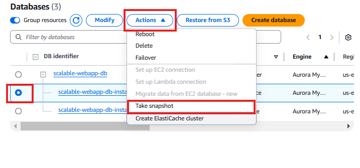

4. **Enter a name** for the snapshot:  
   - Example: `webapp-db-snapshot`

📸 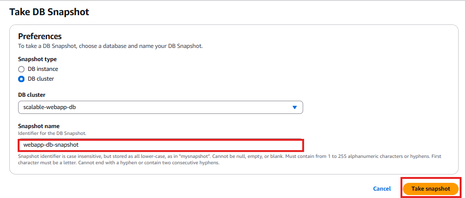

5. Click **Take Snapshot**.
6. **Monitor progress** in **RDS Console → Snapshots**.
7. The **status will change from "Creating" to "Available"**.

📸 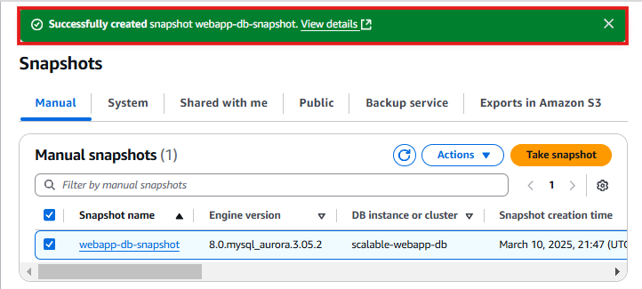

### **Restoring from a Snapshot (If Needed)**
1. **Go to AWS Console** → **RDS** → **Snapshots**.
2. Click on the snapshot (`webapp-db-snapshot`).
3. Click **Actions → Restore Snapshot**.
4. **Choose DB instance class** and **modify settings if necessary**.
5. Click **Create Database**.

📸 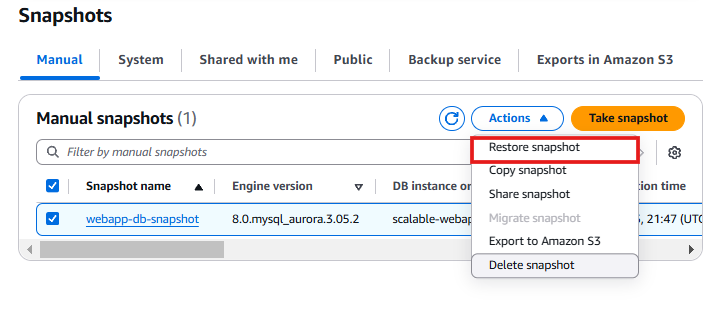

✅ **Why?**
- Ensures **point-in-time recovery** for disaster recovery scenarios.
- Allows **testing new database configurations** without affecting production.

---

## **3️⃣ Changing RDS Instance Type (Scaling Up/Down)**
RDS allows **changing instance types** to **increase performance** or **reduce costs**.

### **Key Considerations for Scaling**
- **Larger instances** improve **performance for high-traffic applications**.
- **Smaller instances** help **reduce costs** when traffic is low.
- **Multi-AZ instances automatically failover before resizing** to minimize downtime.

### **Steps to Scale RDS Instance Type**
1. **Go to AWS Console** → **RDS**.
2. Click **Databases** → **Select the RDS instance (`scalable-webapp-db`)**.
3. Click **Modify**.

📸 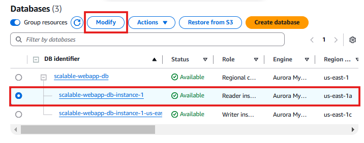

4. **Choose a new instance type:**
   - Example: **Scaling up** from `db.r5.large` to `db.r6g.large`.

📸 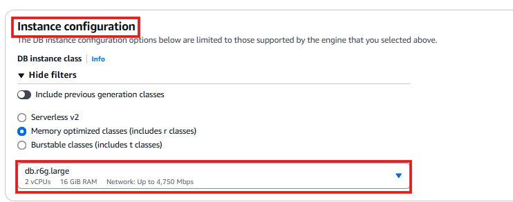

5. Scroll down and **click Continue**.
6. Choose **Apply Immediately**.

📸 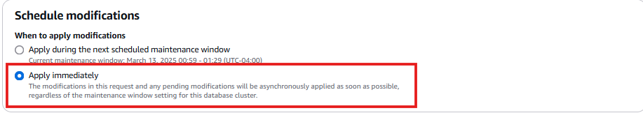

7. Click **Modify DB Instance**.
8. The **DB status will change to "Modifying"**.

📸 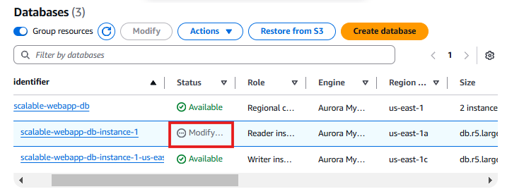

9. After a few minutes, the status will change to **"Available"**, confirming the instance has been resized.

📸 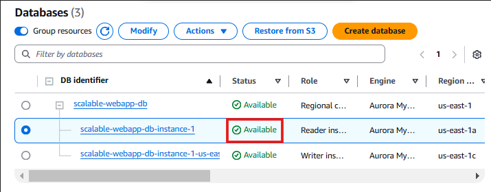

✅ **Why?**
- Improves **database performance** based on workload requirements.
- Allows **cost savings** by scaling down during off-peak hours.
- Ensures **high availability by failing over before modifying**.

---

## **✅ Summary of RDS Performance Optimization**
| **Task**               | **Purpose**                                   | **Estimated Time** |
|------------------------|---------------------------------------------|-------------------|
| **Failover Test**      | Validates high availability across AZs      | ⏳ **2–5 min**  |
| **Create Snapshot**    | Enables manual backup & disaster recovery  | ⏳ **2–10 min** |
| **Scale RDS Instance** | Improves performance or reduces cost       | ⏳ **5–15 min** |

✅ **By implementing these practices, my RDS setup is highly available, fault-tolerant, and scalable.**

---

## **Next Steps**
➡️ **[Connect RDS Aurora](../docs/rds-connection.md)**  
➡️ **[Review Troubleshooting Guide](../docs/troubleshooting.md)**  

---
