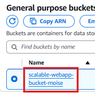
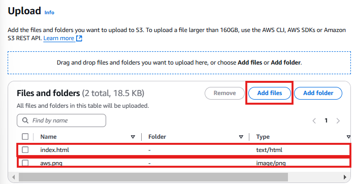
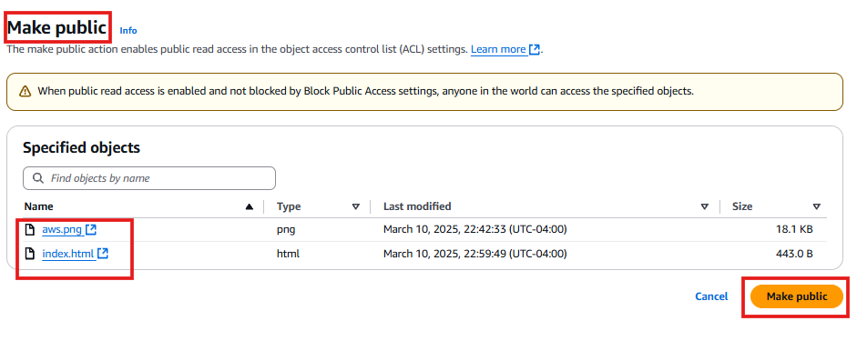
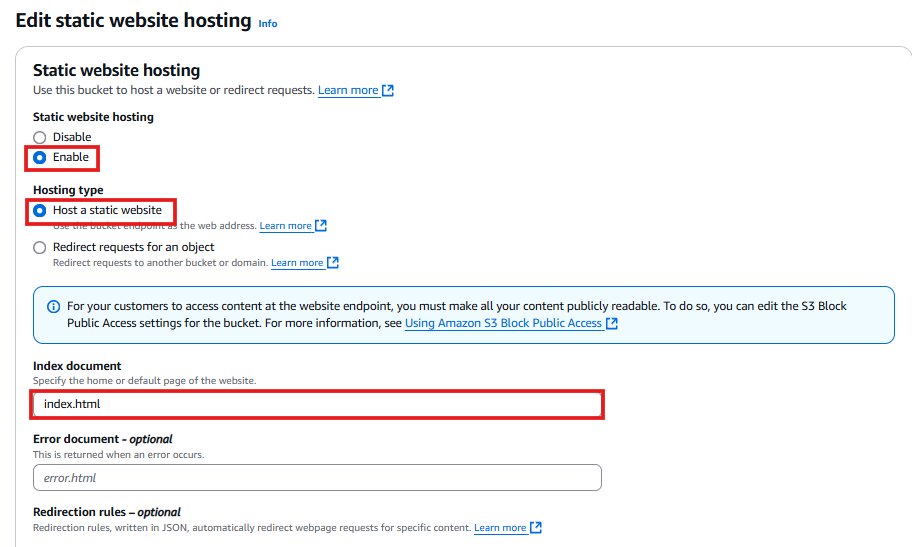
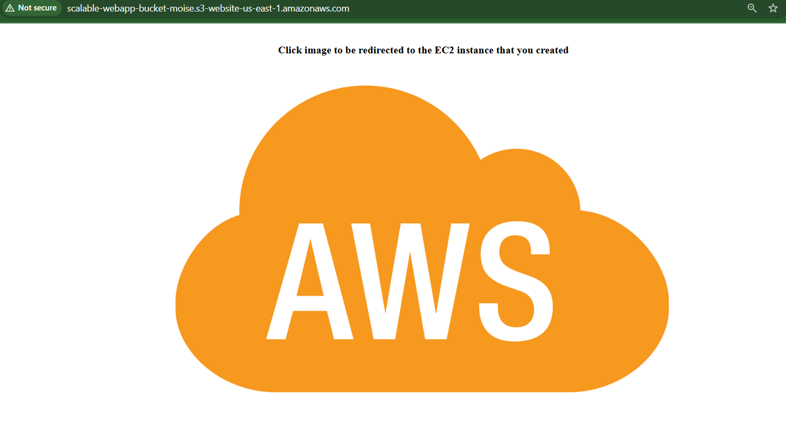
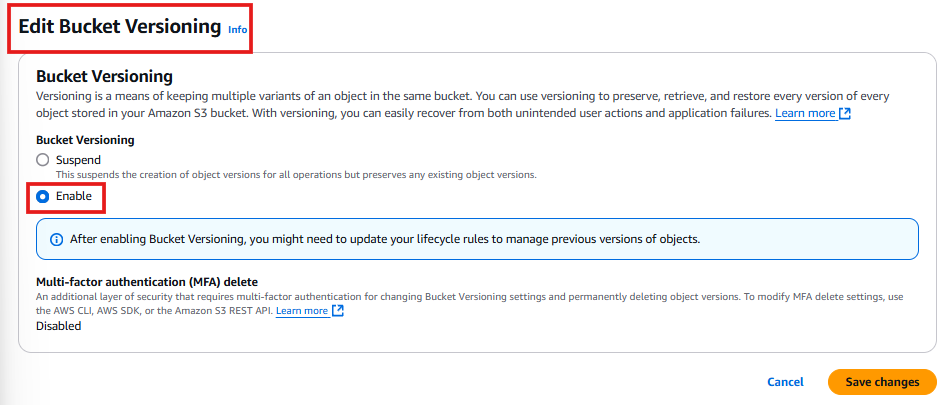
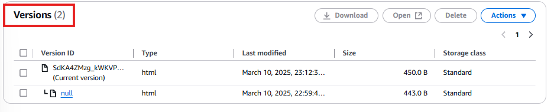
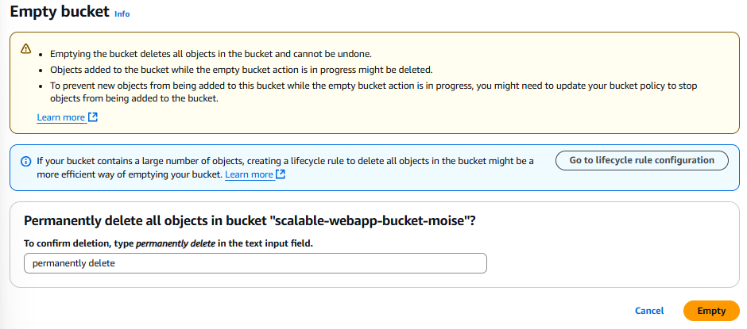

# 🚀 Creating and Configuring an Amazon S3 Bucket  

In this section, I will:

✅ **Create an S3 Bucket** and upload objects to it.  
✅ **Enable static website hosting** for the bucket.  
✅ **Move objects between buckets and enable bucket versioning**.  
✅ **Delete objects and buckets** to avoid unnecessary charges.

---

## **1️⃣ Creating an Amazon S3 Bucket**
I’ll begin by creating an Amazon S3 bucket to store static content such as images and HTML files.

**Steps:**
- Log into the **AWS Management Console**.
- Navigate to **S3** and click **Create Bucket**.
- Enter a unique bucket name (e.g., `scalable-webapp-bucket-moise`).
- Select your preferred region (e.g., `us-east-1`).

> **Best Practice:**  
> Bucket names must be unique globally and follow AWS naming rules.

📸 

---

## **2️⃣ Uploading Objects to the Bucket**
Next, I will upload the necessary static files (an HTML file and an image) into my bucket.

- Files to upload:
  - ✅ `index.html`
  - ✅ `aws.png`

### **Steps to Upload Files:**
1. Select my newly created bucket: `scalable-webapp-bucket`.
2. Click **Upload** → select files (`index.html`, `aws.png`) → Click **Upload**.

📸 

---

## **3️⃣ Making Objects Publicly Accessible**
By default, S3 objects are private. For the web hosting to work, I need to make objects publicly readable.

### Steps:
- Select the uploaded files.
- Click **Actions** → **Make Public** → Confirm action.

📸 

✅ **This allows the static website to serve files publicly.**

---

## **4️⃣ Enabling Static Website Hosting**
Now, I'll enable the static website hosting feature in Amazon S3.

- **Navigate to** S3 bucket → **Properties**.
- Scroll down to **Static website hosting** → Click **Edit**.
- **Select "Enable"**, choose **Host a static website**.
- Specify `index.html` as the index document.
- Click **Save changes**.

📸 

✅ **Now, my bucket hosts a static website accessible publicly via a URL.**

---

## **4️⃣ Testing the Static Website**
I'll now verify that my static website is accessible and properly configured.

- Copy the **website endpoint URL** from bucket properties.
- Open the URL in a web browser.

✅ **Expected Result:** The webpage should load, displaying my uploaded content.

📸 

---

## **4️⃣ Moving Objects Between Buckets**
I will now demonstrate moving objects from one bucket to another (e.g., for backup or organization purposes).

- **Create another bucket** (example: `scalable-webapp-target-bucket`).
- In S3 console, select the files (`aws.png`, `index.html`) → Click **Actions → Move**.
- Select the **destination bucket** → Click **Move objects**.

📌 **Note:** Object permissions remain the same after moving.

📸 

---

## **4️⃣ Enabling Bucket Versioning**
Enabling **versioning** helps preserve previous versions of objects, allowing recovery from unintended overwrites or deletions.

- From bucket properties, click **Bucket Versioning → Edit**.
- **Select "Enable"** → Click **Save changes**.

📌 **Best Practice:**  
Enabling bucket versioning protects against accidental data deletion or overwrites.

📸 

---

## **5️⃣ Testing Bucket Versioning**
I will test bucket versioning by updating and re-uploading the `index.html` file:

- Modify `index.html`.
- Upload the file again to the same bucket.
- Verify the bucket now contains two versions.

📸 

✅ **Result:**  
- I can confirm version history under the **Versions** tab of the object.

---

## **6️⃣ Deleting Objects and Buckets (Cleanup)**
To avoid unnecessary costs, I'll delete resources that are no longer required.

### **Delete Objects**
- In S3 console → Select bucket → Select objects (`index.html`, `aws.png`).
- Click **Actions → Delete** → Confirm.

📸 

### **Delete S3 Bucket**
Buckets must be empty before deletion:

- Select bucket → Click **Delete bucket**.
- Enter bucket name to confirm → Click **Delete bucket**.

📸 

✅ **All unnecessary resources are now deleted.**

---

## **✅ Summary & Best Practices**

| Step                        | Purpose                                  |
|-----------------------------|------------------------------------------|
| **Create Bucket**           | Store static files                        |
| **Upload Objects**          | Prepare content for website               |
| **Publicly Accessible**     | Allow public access to objects            |
| **Static Website Hosting**  | Host static website                       |
| **Bucket Versioning**       | Protects from accidental data loss        |
| **Testing Versioning**      | Ensures data integrity                    |
| **Cleanup Resources**       | Avoid extra AWS charges                   |

---

## ✅ **Next Steps**
➡️ **[Review Troubleshooting Guide](../docs/troubleshooting.md)**    

---
